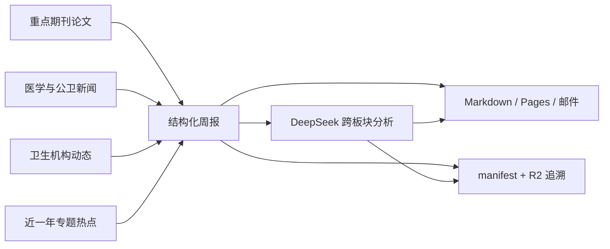

# Research Radar · 医学科研雷达

> 把重点期刊、医学新闻、卫生机构动态和近一年专题热点汇成一份可追溯周报，
> 再用 DeepSeek 提炼对传染病流行病学与数据驱动医学研究真正有用的问题。

Research Radar 是一个公开、无图片、可追溯的医学科研情报系统。它每周一
北京时间 05:33 自动运行，同时生成 Markdown 周报、GitHub Pages 网页、
JSON manifest、R2 原始数据归档和邮件。

- 在线周报：[Research Radar Pages](https://rayeruixinzhang.github.io/Research-Radar/)
- 历史报告：[`reports/`](reports/)
- 逐期追溯清单：[`manifests/`](manifests/)
- 部署说明：[`docs/DEPLOYMENT.md`](docs/DEPLOYMENT.md)

## 一眼看懂五个板块

| 板块 | 回答的问题 | 时间范围 | 核心数据来源 | 数量上限 |
|---|---|---:|---|---:|
| **1. 重点期刊近期论文** | 顶级医学与 CNS 系列本周发表了什么？ | 上一自然周 | PubMed；Europe PMC、OpenAlex补充元数据 | 30篇 |
| **2. 医学与公共卫生新闻** | 全球媒体正在关注哪些健康事件？ | 上一自然周 | Reuters、AP、BBC、STAT、KFF Health News、澎湃新闻 | 15条 |
| **3. 卫生机构动态** | WHO及主要国家发布了哪些预警、指南和政策？ | 上一自然周 | WHO、CDC/MMWR/HHS、PHAC、国家卫健委/中国CDC、UKHSA/NHS、ECDC、澳大利亚卫生部、PAHO | 20条 |
| **4. 近一年专题科研热点** | 感染与流行病学相关Q1研究正在形成哪些热点？ | 最近365天 | PubMed/MEDLINE + SCImago Medicine Q1；Europe PMC、OpenAlex增强 | 最多2,000条候选，展示10个热点 |
| **5. 跨板块科研启发** | 四类信号如何转化为研究问题和方法？ | 基于本期板块1–4 | DeepSeek V4 Flash + 本期结构化输入 | 1份结构化分析 |



## 聚焦领域

系统重点识别并标注以下方向：

- 流行病学、疾病监测、暴发调查和风险预测；
- 传染病、感染、病原体、疫情与大流行；
- 公共卫生、人口健康、健康政策和健康公平；
- 儿科学、新生儿与儿童健康；
- 呼吸道疾病、肺炎、流感、哮喘和慢阻肺；
- 疫苗、免疫接种、效果与安全性；
- 医院感染、感染控制和抗微生物药物耐药；
- AI/机器学习与疾病监测、预警、预测模型的交叉研究。

板块2、3和重点期刊板块还会覆盖医疗、卫生服务与卫生系统等更广的内容；
板块4则采用更严格的感染与流行病学专题范围。

## 板块4如何筛选近一年热点

板块4不是“整个PubMed近一年全部医学论文”，而是一个透明、受控的专题样本：

1. 在PubMed检索最近365天的 `MEDLINE` 子集；
2. 检索式首先限定流行病学、传染病、公共卫生、儿科、呼吸道、感染、疫苗、
   院感/耐药以及疾病监测和预测；
3. 当前每次回填最多取得按出版日期排序的2,000条候选记录；
4. 仅保留具有DOI、未标记撤稿、且ISSN匹配
   **SCImago 2025 Medicine Q1** 的论文；
5. 再根据标题、摘要、MeSH和主题标签执行第二次专题筛选；
6. OpenAlex提供主主题和标准化引用指标，MeSH作为医学标签；
7. 主题至少包含5篇论文并覆盖3种期刊后才参与排名。

热点分数：

`论文量 40% + 近90天增长 30% + 标准化引用 20% + 期刊多样性 10%`

报告展示前10个主题，每个主题展示3篇代表论文。完整检索式和筛选词保存在
[`config/settings.yaml`](config/settings.yaml)，每期manifest同时保存口径版本。

> **重要：SCImago Q1 不等同于 JCR Q1。** 本项目明确使用可公开复核的
> SCImago Medicine Q1替代口径，不会将其标注为JCR分区。

## 板块5能做什么

DeepSeek只读取板块1–4已经展示的标题、短摘要、标签和来源标识，生成：

1. 四板块综合研判；
2. 对传染病流行病学的启示；
3. 可检验的数据驱动医学研究问题；
4. 候选研究方法与数据需求；
5. 证据局限、偏倚与可推广性提醒。

每项分析必须引用输入中的证据编号；程序会丢弃模型虚构的编号，并将有效编号
链接回DOI或原始页面。提示词位于
[`prompts/cross_board_analysis_zh.md`](prompts/cross_board_analysis_zh.md)，
模型、提示词版本、输入SHA-256、条目数量和token用量都会写入manifest。

## 数据追溯

```text
原始响应（gzip JSON，R2）
        ↓ SHA-256 / R2对象键
SQLite标准化记录
        ↓ item_id / DOI / URL / content_hash
周报 Markdown + Pages
        ↓ Git提交 / Actions Run ID
manifest/YYYY/YYYY-Www.json
```

- 论文以标准化DOI去重，新闻优先使用canonical URL；
- 新闻和机构动态只保存标题、原始链接、发布日期及不超过250字符的摘要；
- 不保存新闻全文，不在周报中放置图片；
- 论文必须有可点击DOI，新闻和机构内容必须有原始链接；
- 单个来源失败时继续生成周报并在“数据源运行状态”中标注。

## 快速开始

```powershell
python -m venv .venv
.venv\Scripts\pip install -e ".[dev]"

python -m research_radar doctor
python -m research_radar import-scimago "incoming\scimagojr.csv"
python -m research_radar backfill --days 365 --retmax 2000
python -m research_radar collect --days 7
python -m research_radar build-report
pytest
```

固定CLI：

- `python -m research_radar backfill --days 365`
- `python -m research_radar collect --days 7`
- `python -m research_radar build-report --send-email`
- `python -m research_radar doctor`

## 自动部署

工作流位于 [`.github/workflows/research-radar.yml`](.github/workflows/research-radar.yml)：

- 每周一北京时间05:33自动运行；
- 支持手动周报和365天完整回填；
- 自动恢复/上传R2 SQLite数据库；
- 自动提交周报与manifest；
- 自动发布GitHub Pages并发送163邮箱。

Secrets配置见[部署说明](docs/DEPLOYMENT.md)，密钥不得写入代码、报告或Issue。

## 使用时必须知道的限制

- 板块4当前有2,000条候选上限，因此代表“专题聚焦样本”，不是近一年全部Q1论文；
- PubMed/MEDLINE之外的论文可能遗漏；ResearchGate不自动抓取，Web of Science/JCR
  适配器尚未启用；
- GDELT用于发现缺少稳定RSS的页面，可能受限流、索引延迟和域名覆盖影响；
- 摘要来自公开元数据，可能缺失或晚于出版时间更新；
- OpenAlex主题可能过宽，热点标题应结合代表论文和MeSH理解；
- DeepSeek输出是研究启发而非系统综述、因果结论或临床建议，必须回到原文核查；
- 来源状态、API价格、网页结构和期刊分区会变化，应定期审计配置。

## 许可证与来源

本项目参考并衍生自GPLv3项目
[TrendRadar](https://github.com/sansan0/TrendRadar)，以
GPL-3.0-or-later发布。详见 [`LICENSE`](LICENSE) 与 [`NOTICE`](NOTICE)。
